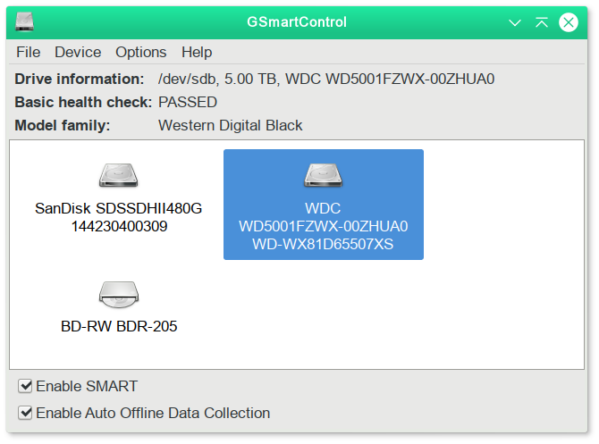
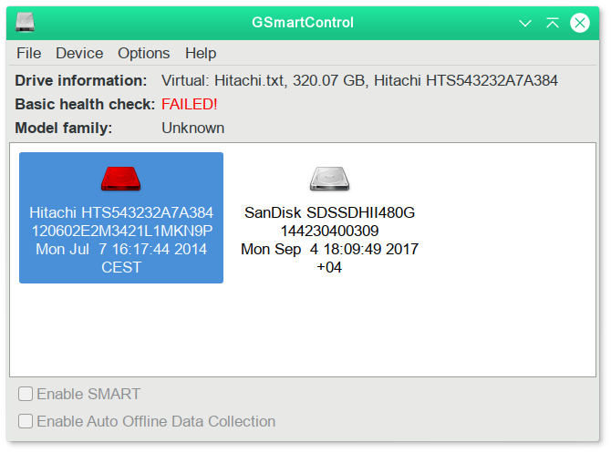
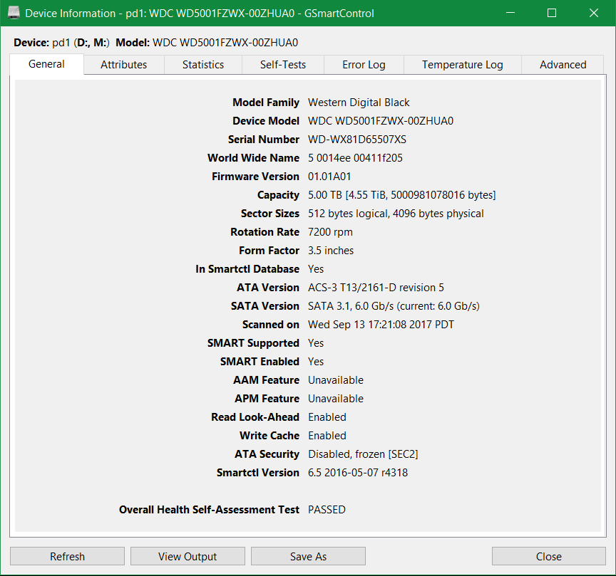
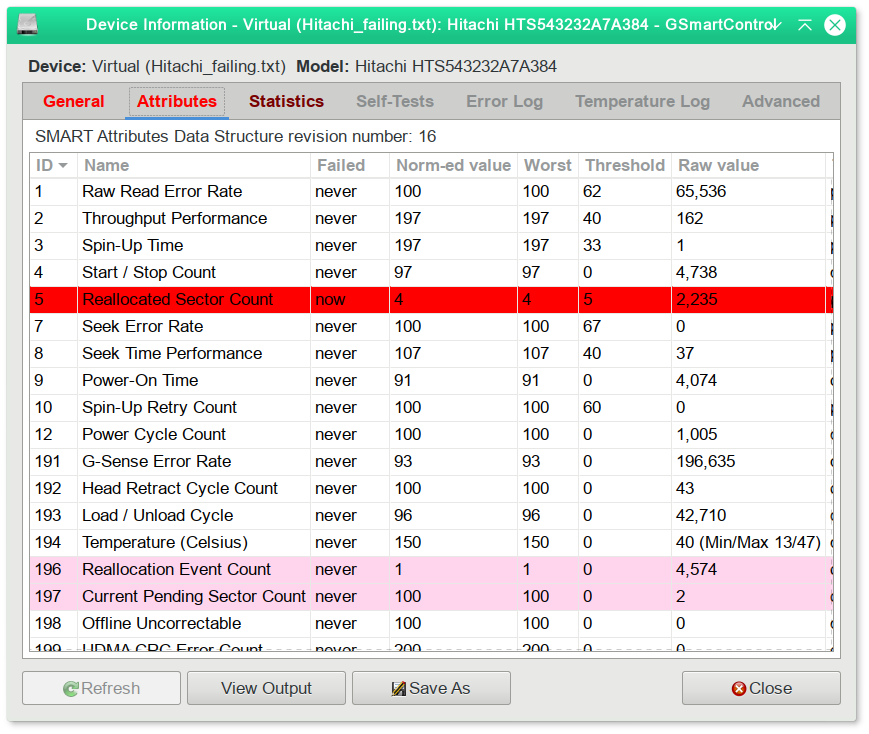
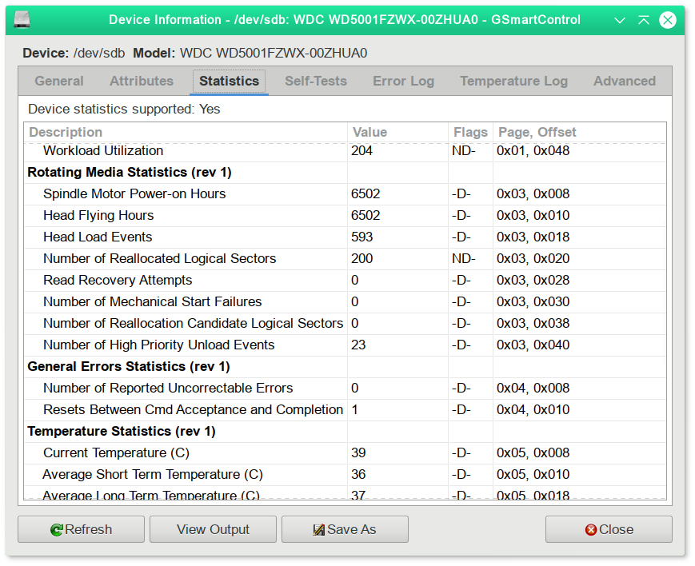
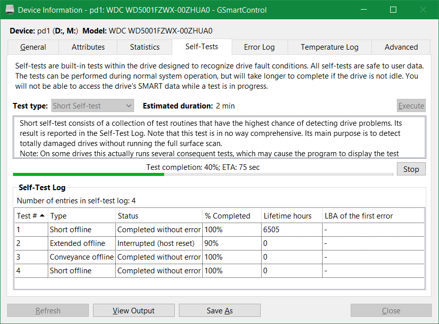
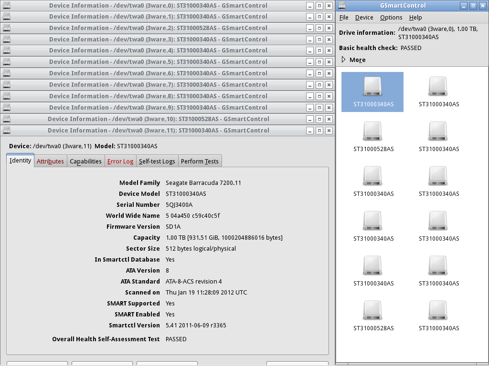

# Screenshots

**Note:** Some of these screenshots may have been taken with older versions
of GSmartControl.

## Main window - All drives pass the health self-check

## Main window - One of the drives is failing

## Drive information window - General information

## Drive information window - A failing drive, attribute list

## Drive information window - Statistics

## A test in progress

## Twelve 1TB drives behind a single 3ware RAID controller

